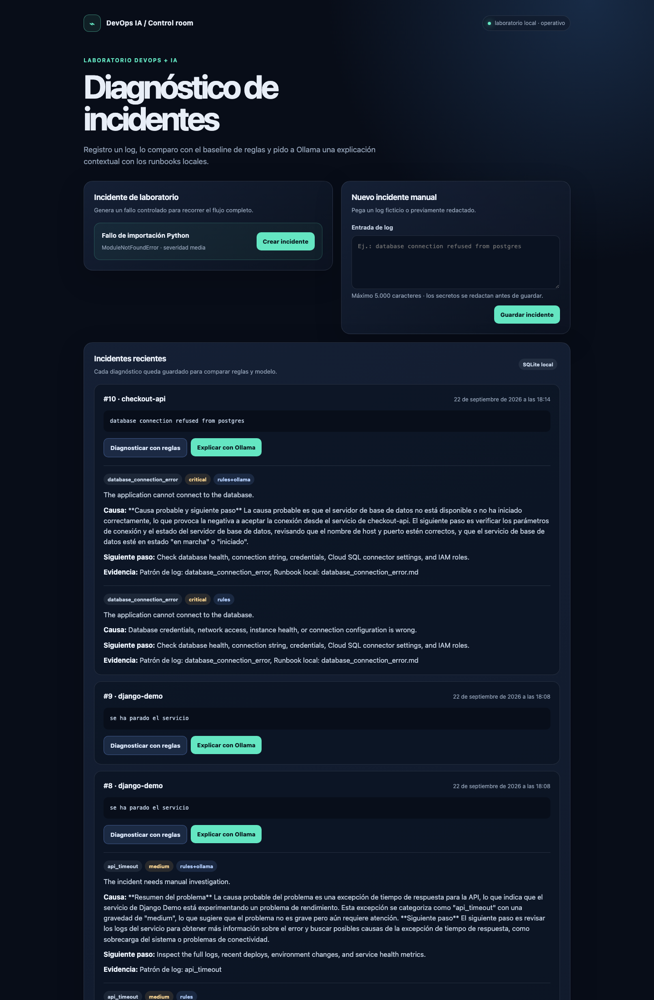
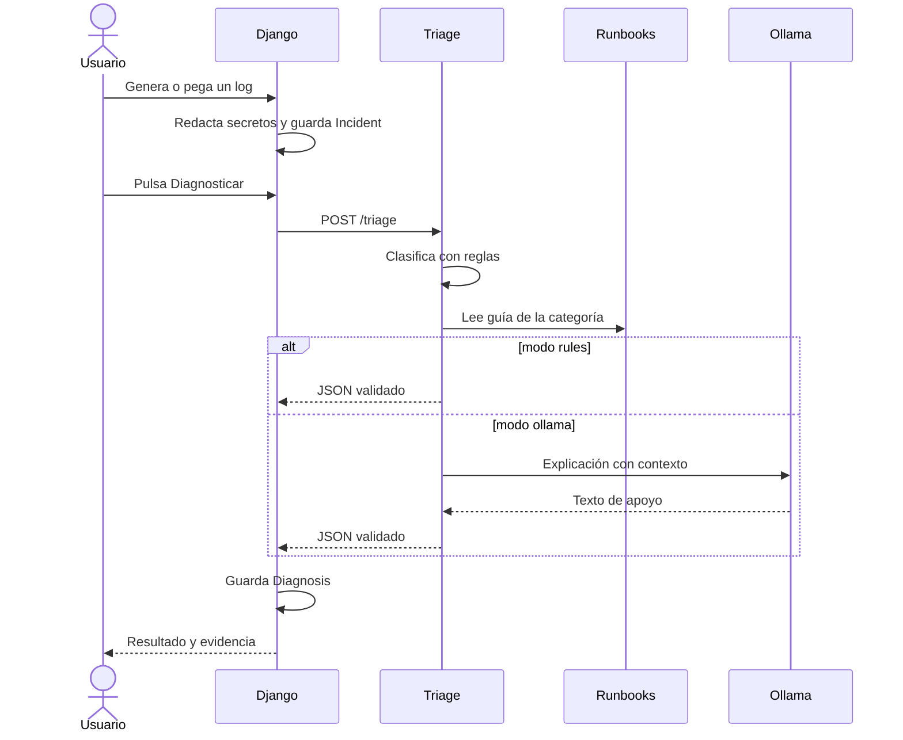
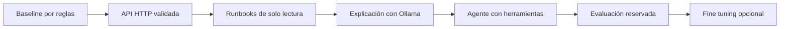

# Proyecto final: laboratorio de diagnóstico DevOps con IA

## Qué presento en este proyecto

En este proyecto convierto parte de lo aprendido en el curso `DevOps_IA_LLMS` en un laboratorio local que puedo ejecutar y explicar de principio a fin. Mi objetivo es entender cómo se diagnostica un incidente DevOps y qué aporta un modelo de lenguaje cuando ya tengo un diagnóstico base controlado.

He construido una aplicación con Django para registrar incidentes, un servicio FastAPI para clasificarlos y Ollama para redactar una explicación contextual. Todo se ejecuta con Podman Compose y lo he validado localmente con reglas y con el modelo `llama3.2:3b`.

Lee primero el [diagrama de arquitectura](docs/arquitectura.md).

## Captura del laboratorio

En esta captura muestro un incidente manual de conexión a PostgreSQL y comparo mi diagnóstico determinista (`rules`) con la explicación contextual (`rules+ollama`):



## La idea en 60 segundos



He separado deliberadamente las responsabilidades: las reglas deciden la categoría y la gravedad; Ollama redacta una explicación opcional. De esta forma puedo medir qué aporta el modelo sin atribuirle aciertos que realmente pertenecen al baseline.

## Cómo he organizado el proyecto

```text
proyecto_final_devops_ia_llm/
├── README.md                    Esta guía
├── docs/arquitectura.md         Diagrama y recorrido de datos
├── compose.yaml                 Tres servicios, red interna y volúmenes
├── .env.example                 Variables locales de ejemplo
├── django_app/                  Web de incidentes y diagnósticos
│   ├── Containerfile
│   ├── requirements.txt
│   ├── config/                 Configuración Django
│   └── incidents/              Modelos, vistas y plantilla HTML
├── triage_service/              API FastAPI de diagnóstico
│   ├── Containerfile
│   ├── requirements.txt
│   ├── main.py
│   └── triage_core/             Copia del baseline del curso
└── runbooks/                   Consejos locales por categoría
```

La copia de `triage_core/` procede de `../pta-ai-devops/finetuning/triage_core/`. La he incluido de forma aislada para que la imagen no tenga que copiar todo el repositorio del curso. Si modifico las reglas, tengo que decidir si sincronizo también la versión original. **No copio `apuntes.md` ni claves a las imágenes.**

## Requisitos

- Podman y un proveedor Compose (`podman-compose` está instalado en este ordenador).
- En macOS, necesito una `podman machine` creada y arrancada desde la terminal. Podman usa una VM Linux en este sistema ([documentación](https://docs.podman.io/en/latest/markdown/podman-machine-start.1.html)).
- Conexión a Internet para descargar las imágenes y, si usas Ollama, el modelo. La clasificación por reglas no llama a ningún proveedor de IA.
- Memoria suficiente para el modelo que elijo; empiezo con uno pequeño y ajusto la memoria de Podman machine según mi equipo.

### Comprobar el espacio real de Podman

`podman machine list` muestra el tamaño del disco virtual configurado, pero no necesariamente el tamaño de la partición Linux que usa el almacenamiento de imágenes. Para revisar ambos valores:

```bash
podman machine inspect podman-machine-default
podman machine ssh podman-machine-default 'df -h /; lsblk -o NAME,SIZE,FSTYPE,MOUNTPOINTS'
```

En macOS con la máquina `applehv`, si el disco virtual es mayor que `/dev/vda4` y el sistema de archivos es XFS, la ampliación se puede hacer dentro de la VM con `growpart` y `xfs_growfs`. Hazlo solo después de comprobar los dispositivos y con los contenedores detenidos:

```bash
podman machine stop
podman machine start
podman machine ssh podman-machine-default 'sudo growpart /dev/vda 4 && sudo xfs_growfs / && df -h /'
```

El número de partición (`4`) y el dispositivo (`/dev/vda`) son específicos de la máquina de este laboratorio; comprueba `lsblk` antes de reutilizar el comando en otra VM. La ampliación aumenta el espacio disponible y no elimina imágenes, volúmenes ni contenedores.

## Cómo lo ejecuto en mi ordenador

Estos son los pasos que utilizo para levantar el laboratorio en mi ordenador.

```bash
cd proyecto_final_devops_ia_llm
podman machine list
# Si no existe: podman machine init --now
# Si existe y está parada: podman machine start
cp .env.example .env
# Cambia DJANGO_SECRET_KEY en .env por una cadena aleatoria local.
podman-compose -f compose.yaml config
podman-compose -f compose.yaml build
podman-compose -f compose.yaml up -d
podman-compose -f compose.yaml ps
```

La orden anterior levanta la ruta **rules-only** y no descarga Ollama. Cuando quiero probar también la explicación generada, activo el perfil opcional:

```bash
podman-compose -f compose.yaml --profile llm up -d
```

Abro `http://127.0.0.1:8000`, creo un incidente y pulso **Diagnosticar con reglas** o **Explicar con Ollama**. El resultado queda en SQLite, dentro del volumen `django_data`. Para revisar qué ocurre entre servicios uso:

```bash
podman-compose -f compose.yaml logs django
podman-compose -f compose.yaml logs triage
```

Para una comprobación automatizada dentro de los contenedores, esta prueba crea un incidente, llama a triage y consulta el diagnóstico persistido:

```bash
podman-compose -f compose.yaml exec -T django python - <<'PY'
import os
os.environ.setdefault("DJANGO_SETTINGS_MODULE", "config.settings")
import django
django.setup()
from django.test import Client
from incidents.models import Incident, Diagnosis

client = Client(enforce_csrf_checks=False)
host = {"HTTP_HOST": "localhost"}
client.post("/incidents/demo/", **host)
incident = Incident.objects.first()
client.post(f"/incidents/{incident.pk}/diagnose/", {"mode": "rules"}, **host)
diagnosis = Diagnosis.objects.filter(incident=incident).first()
print(diagnosis.category, diagnosis.severity, diagnosis.model_backend)
PY
```

La salida esperada para el fallo incluido es `python_import_error medium rules`.

La orden `config` valida primero la composición sin crear contenedores. El healthcheck hace que Django espere a que triage esté sano. Ollama es opcional: triage puede clasificar por reglas sin él y devuelve `503` en modo `ollama` hasta que el perfil esté activo y el modelo descargado.

La API triage no se publica en el host. Desde su propio contenedor puedo consultar su salud:

```bash
podman-compose -f compose.yaml exec triage python -c "import urllib.request; print(urllib.request.urlopen('http://localhost:8001/health').read().decode())"
```

### Activar la explicación de Ollama

El servicio Ollama estará creado al levantar Compose, pero el volumen empieza sin modelos. Descarga el modelo indicado en `.env` y espera a que termine:

```bash
podman-compose -f compose.yaml --profile llm exec ollama ollama pull llama3.2:3b
```

Después pulso **Explicar con Ollama** en Django. Si cambio `OLLAMA_MODEL`, descargo ese modelo y recreo `triage` para que lea la variable nueva. Esta versión usa el modelo para redactar la causa, pero conserva categoría y gravedad del baseline por reglas; todavía no implementa selección autónoma de herramientas.

La primera petición puede tardar porque Ollama carga los pesos en memoria. Si triage devuelve `503` durante esa primera carga, espera a que `ollama list` muestre el modelo y vuelve a pulsar el botón:

```bash
podman-compose -f compose.yaml --profile llm exec ollama ollama list
podman-compose -f compose.yaml --profile llm logs triage
```

Django ejecuta Gunicorn con un timeout de 180 segundos para permitir esa primera inferencia local. Si mi equipo tarda más, puedo reconstruir Django con otro valor, por ejemplo `GUNICORN_TIMEOUT=300`.

Para parar los servicios sin borrar los datos:

```bash
podman-compose -f compose.yaml down
```

## Cómo explicaría la comparación al profesor

Para evaluar el proyecto uso el mismo incidente y ejecuto primero **Diagnosticar con reglas** y después **Explicar con Ollama**. Comparo estos campos:

| Campo | Reglas | Ollama |
| --- | --- | --- |
| `category` | La decide `triage_with_rules()` mediante patrones de texto. | Se conserva la categoría de las reglas. |
| `severity` | La decide el baseline (`low`, `medium`, `high` o `critical`). | Se conserva la gravedad de las reglas. |
| `summary` | Texto fijo y reproducible. | Se conserva el resumen del baseline. |
| `root_cause` | Explicación fija asociada a la regla. | Texto generado por el modelo con el log, la categoría y el runbook. |
| `suggested_fix` | Recomendación fija y auditable. | Se conserva la recomendación del baseline. |
| `model_backend` | `rules`. | `rules+ollama`. |

Ejemplo observado con `ModuleNotFoundError: No module named requests`:

- Reglas: categoría `python_import_error`, gravedad `medium` y causa genérica sobre `PYTHONPATH`, estructura de paquetes y dependencias.
- Ollama: la misma categoría y gravedad, pero explica que `requests` probablemente no está instalado y propone comprobar la imagen activa.

Con esta comparación demuestro qué aporta cada capa. Las reglas me dan control, repetibilidad y una salida auditable. Ollama aporta una explicación más contextual, pero puede tardar o interpretar demasiado el texto. Si el modelo falla o no está disponible, el diagnóstico por reglas sigue siendo mi resultado de referencia.

## Qué he aprendido al recorrer el código

1. **Django:** `incidents/models.py` define un incidente y sus diagnósticos; `views.py` crea el fallo de prueba, redacta valores sensibles y hace la llamada HTTP. La plantilla muestra ambos resultados.
2. **Contenedores:** `compose.yaml` conecta servicios por nombre. Solo publica Django en `127.0.0.1`; SQLite y el modelo sobreviven en volúmenes.
3. **Baseline:** `triage_service/triage_core/rules.py` aplica reglas del curso. Cambia una regla y verifica qué ejemplos mejoran o empeoran.
4. **Contexto:** `triage_service/main.py` lee un runbook para la categoría detectada. Añade un runbook para otra categoría y observa cómo cambia la evidencia.
5. **LLM local:** el modo `ollama` envía log, categoría y runbook al modelo. Compara su explicación con el resultado por reglas y anota errores.
6. **Siguiente práctica:** quiero convertir la lectura de runbooks en una herramienta elegida por un agente, añadir una evaluación con casos reservados y solo después estudiar LoRA.

## Qué observar en cada prueba

| Prueba | Resultado esperado | Qué estás aprendiendo |
| --- | --- | --- |
| Crear fallo de importación | Aparece un incidente y un mensaje en los logs de Django. | Cómo una aplicación convierte una excepción en un dato persistente. |
| Diagnosticar con reglas | `python_import_error`, gravedad `medium` y runbook local. | El baseline es determinista y auditable. |
| Diagnosticar con Ollama sin modelo | Mensaje `503` y el incidente permanece guardado. | Los servicios pueden estar vivos aunque el modelo no esté disponible. |
| Diagnosticar con Ollama preparado | Misma categoría/gravedad y una explicación generada. | El LLM añade lenguaje, pero debe respetar el contrato y el contexto. |
| Parar y volver a levantar | Los incidentes siguen en SQLite y el modelo en su volumen. | La diferencia entre contenedor efímero y volumen persistente. |

## Progresión del proyecto



Cada flecha debe producir una comparación medible. Mantendré una tabla con categoría, gravedad, JSON válido, latencia y llamadas a herramientas. Dejo el fine tuning para la última etapa porque no corrige automáticamente un contrato débil, datos con fugas o una evaluación mal separada.

## Límites conocidos

- La redacción de secretos en `incidents/views.py` es **básica**; usa solo logs ficticios o previamente revisados. No envíes incidentes reales con credenciales.
- El modo Ollama puede tardar o devolver `503` si el modelo no se ha descargado o no está listo. El modo de reglas sigue disponible.
- Si el navegador muestra `Internal Server Error` y en los logs aparece `WORKER TIMEOUT`, revisa que Django esté usando el `Containerfile` actual, reconstruye la imagen y comprueba que `GUNICORN_TIMEOUT` sea suficiente para la primera carga del modelo.
- La vista hace la petición de diagnóstico de forma síncrona. Para una aplicación con tráfico real, moverías este trabajo a una cola y añadirías autenticación, límites y monitorización.
- Esta primera versión **no es todavía un agente** ni incluye fine tuning. Separa intencionadamente baseline, explicación y futuro agente para poder medir qué aporta cada pieza.
- La integración local se ha probado con los servicios levantados, el modelo `llama3.2:3b` descargado y una petición real en ambos modos. La primera inferencia de Ollama puede ser más lenta porque carga el modelo en memoria.

## Fuentes oficiales

- [Podman Compose](https://docs.podman.io/en/latest/markdown/podman-compose.1.html).
- [Logging en Django](https://docs.djangoproject.com/en/5.2/topics/logging/).
