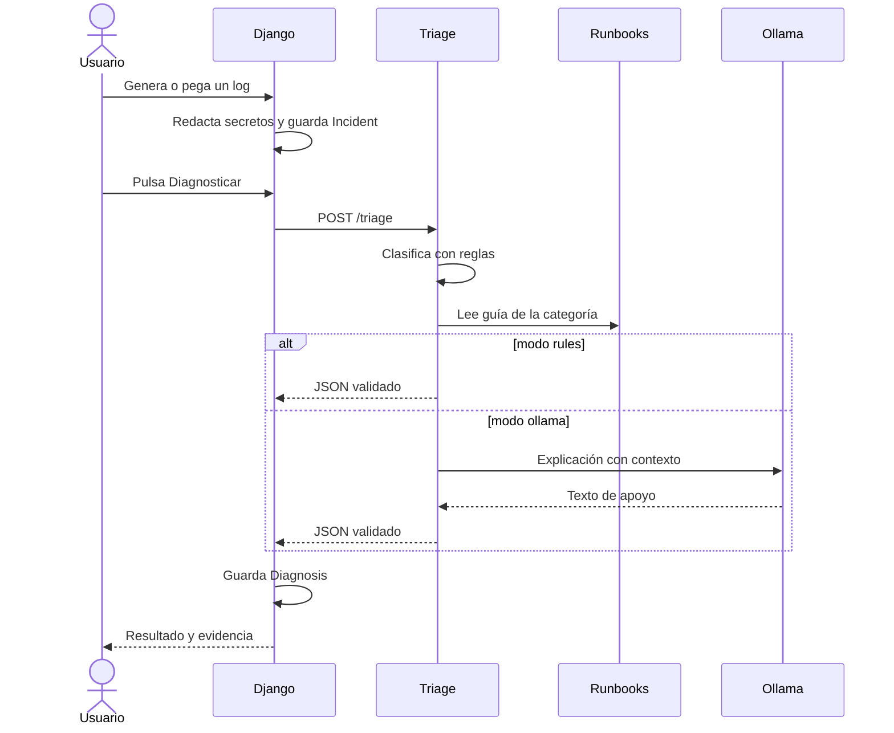
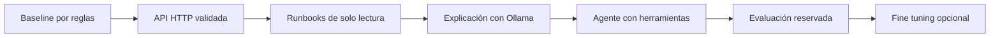

# Proyecto final: diagnóstico local de incidentes Django

Este laboratorio convierte las prácticas de `pta-ai-devops/finetuning/` en una aplicación que puedes estudiar de principio a fin. Django genera o registra incidentes, un servicio FastAPI los clasifica y Ollama puede explicar el resultado con un modelo local. Todo está definido para **Podman Compose**, pero **no he construido imágenes ni arrancado contenedores**.

Lee primero el [diagrama de arquitectura](docs/arquitectura.md).

## La idea en 60 segundos



La frontera didáctica es deliberada: las reglas deciden categoría y gravedad; Ollama redacta una explicación opcional. Así puedes medir qué aporta el modelo sin atribuirle aciertos que realmente pertenecen al baseline.

## Qué hay en este directorio

```text
proyecto_final_devops_ia_llm/
├── README.md                    Esta guía
├── docs/arquitectura.md         Diagrama y recorrido de datos
├── compose.yaml                 Tres servicios, red interna y volúmenes
├── .env.example                 Variables locales de ejemplo
├── django_app/                  Web de incidentes y diagnósticos
│   ├── Containerfile
│   ├── requirements.txt
│   ├── config/                 Configuración Django
│   └── incidents/              Modelos, vistas y plantilla HTML
├── triage_service/              API FastAPI de diagnóstico
│   ├── Containerfile
│   ├── requirements.txt
│   ├── main.py
│   └── triage_core/             Copia del baseline del curso
└── runbooks/                   Consejos locales por categoría
```

La copia de `triage_core/` procede de `../pta-ai-devops/finetuning/triage_core/` para que el contexto de construcción de la imagen no incluya todo el repositorio. Si mejoras las reglas, decide conscientemente si sincronizar ambas versiones. **No se copia `apuntes.md` ni ninguna clave a las imágenes.**

## Requisitos

- Podman y un proveedor Compose (`podman-compose` está instalado en este ordenador).
- En macOS, una `podman machine` creada y arrancada desde tu terminal. Podman usa una VM Linux en este sistema ([documentación](https://docs.podman.io/en/latest/markdown/podman-machine-start.1.html)).
- Conexión a Internet para descargar las imágenes y, si usas Ollama, el modelo. La clasificación por reglas no llama a ningún proveedor de IA.
- Memoria suficiente para el modelo que elijas; empieza con uno pequeño y ajusta la memoria de Podman machine según tu equipo.

## Cómo probarlo localmente

Estas son instrucciones para ti; no se han ejecutado en esta tarea.

```bash
cd proyecto_final_devops_ia_llm
podman machine list
# Si no existe: podman machine init --now
# Si existe y está parada: podman machine start
cp .env.example .env
# Cambia DJANGO_SECRET_KEY en .env por una cadena aleatoria local.
podman-compose -f compose.yaml config
podman-compose -f compose.yaml build
podman-compose -f compose.yaml up -d
podman-compose -f compose.yaml ps
```

La orden anterior levanta la ruta **rules-only** y no descarga Ollama. Para incluir el modelo cuando dispongas de espacio suficiente en la VM, usa el perfil opcional:

```bash
podman-compose -f compose.yaml --profile llm up -d
```

Abre `http://127.0.0.1:8000`. Pulsa **Crear fallo de importación de prueba** y después **Diagnosticar con reglas**. El resultado quedará en SQLite, dentro del volumen `django_data`. Para ver la petición y los errores:

```bash
podman-compose -f compose.yaml logs django
podman-compose -f compose.yaml logs triage
```

Para una comprobación automatizada dentro de los contenedores, esta prueba crea un incidente, llama a triage y consulta el diagnóstico persistido:

```bash
podman-compose -f compose.yaml exec -T django python - <<'PY'
import os
os.environ.setdefault("DJANGO_SETTINGS_MODULE", "config.settings")
import django
django.setup()
from django.test import Client
from incidents.models import Incident, Diagnosis

client = Client(enforce_csrf_checks=False)
host = {"HTTP_HOST": "localhost"}
client.post("/incidents/demo/", **host)
incident = Incident.objects.first()
client.post(f"/incidents/{incident.pk}/diagnose/", {"mode": "rules"}, **host)
diagnosis = Diagnosis.objects.filter(incident=incident).first()
print(diagnosis.category, diagnosis.severity, diagnosis.model_backend)
PY
```

La salida esperada para el fallo incluido es `python_import_error medium rules`.

La orden `config` valida primero la composición sin crear contenedores. El healthcheck hace que Django espere a que triage esté sano. Ollama es opcional: triage puede clasificar por reglas sin él y devuelve `503` en modo `ollama` hasta que el perfil esté activo y el modelo descargado.

La API triage no se publica en el host. Desde su propio contenedor puedes consultar salud:

```bash
podman-compose -f compose.yaml exec triage python -c "import urllib.request; print(urllib.request.urlopen('http://localhost:8001/health').read().decode())"
```

### Activar la explicación de Ollama

El servicio Ollama estará creado al levantar Compose, pero el volumen empieza sin modelos. Descarga el modelo indicado en `.env` y espera a que termine:

```bash
podman-compose -f compose.yaml --profile llm exec ollama ollama pull llama3.2:3b
```

Después pulsa **Explicar con Ollama** en Django. Si cambias `OLLAMA_MODEL`, descarga ese modelo y recrea `triage` para que lea la variable nueva. Esta versión usa el modelo para redactar la causa, pero conserva categoría y gravedad del baseline por reglas; aún no implementa selección autónoma de herramientas.

Para parar los servicios sin borrar los datos:

```bash
podman-compose -f compose.yaml down
```

## Qué aprenderás al recorrer el código

1. **Django:** `incidents/models.py` define un incidente y sus diagnósticos; `views.py` crea el fallo de prueba, redacta valores sensibles y hace la llamada HTTP. La plantilla muestra ambos resultados.
2. **Contenedores:** `compose.yaml` conecta servicios por nombre. Solo publica Django en `127.0.0.1`; SQLite y el modelo sobreviven en volúmenes.
3. **Baseline:** `triage_service/triage_core/rules.py` aplica reglas del curso. Cambia una regla y verifica qué ejemplos mejoran o empeoran.
4. **Contexto:** `triage_service/main.py` lee un runbook para la categoría detectada. Añade un runbook para otra categoría y observa cómo cambia la evidencia.
5. **LLM local:** el modo `ollama` envía log, categoría y runbook al modelo. Compara su explicación con el resultado por reglas y anota errores.
6. **Siguiente práctica:** convierte la lectura de runbooks en una herramienta elegida por un agente, añade evaluación de casos reservados y solo entonces considera LoRA.

## Qué observar en cada prueba

| Prueba | Resultado esperado | Qué estás aprendiendo |
| --- | --- | --- |
| Crear fallo de importación | Aparece un incidente y un mensaje en los logs de Django. | Cómo una aplicación convierte una excepción en un dato persistente. |
| Diagnosticar con reglas | `python_import_error`, gravedad `medium` y runbook local. | El baseline es determinista y auditable. |
| Diagnosticar con Ollama sin modelo | Mensaje `503` y el incidente permanece guardado. | Los servicios pueden estar vivos aunque el modelo no esté disponible. |
| Diagnosticar con Ollama preparado | Misma categoría/gravedad y una explicación generada. | El LLM añade lenguaje, pero debe respetar el contrato y el contexto. |
| Parar y volver a levantar | Los incidentes siguen en SQLite y el modelo en su volumen. | La diferencia entre contenedor efímero y volumen persistente. |

## Progresión del proyecto



Cada flecha debe producir una comparación medible. Conserva una tabla con categoría, gravedad, JSON válido, latencia y llamadas a herramientas. El fine tuning es la última etapa porque no corrige automáticamente un contrato débil, datos con fugas o una evaluación mal separada.

## Límites conocidos

- La redacción de secretos en `incidents/views.py` es **básica**; usa solo logs ficticios o previamente revisados. No envíes incidentes reales con credenciales.
- El modo Ollama puede tardar o devolver `503` si el modelo no se ha descargado o no está listo. El modo de reglas sigue disponible.
- La vista hace la petición de diagnóstico de forma síncrona. Para una aplicación con tráfico real, moverías este trabajo a una cola y añadirías autenticación, límites y monitorización.
- Esta primera versión **no es todavía un agente** ni incluye fine tuning. Separa intencionadamente baseline, explicación y futuro agente para poder medir qué aporta cada pieza.
- No se han ejecutado pruebas de integración con contenedores; la definición de Compose y los módulos Python se pueden validar sin arrancarlos.

## Fuentes oficiales

- [Podman Compose](https://docs.podman.io/en/latest/markdown/podman-compose.1.html).
- [Logging en Django](https://docs.djangoproject.com/en/5.2/topics/logging/).
