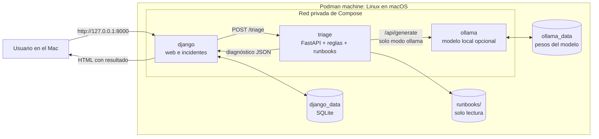
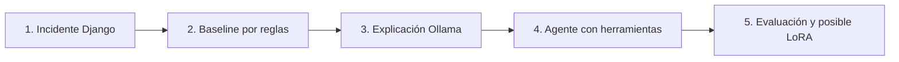

# Arquitectura del laboratorio

El proyecto ejecuta tres servicios en una red privada de Podman Compose. **Los archivos están preparados; ningún contenedor se ha arrancado.** La primera versión funciona con reglas sin descargar un modelo. Ollama se añade al recorrido cuando eliges «Explicar con Ollama» y has descargado el modelo indicado en `.env`.

## Qué sucede al pulsar cada botón

1. **Crear fallo de importación de prueba:** Django intenta importar un módulo inexistente, captura el error, escribe un mensaje en stdout y guarda un `Incident` en SQLite.
2. **Diagnosticar con reglas:** Django envía el log a `triage:8001`. FastAPI usa una copia de `triage_core/rules.py` del curso, busca un runbook según la categoría y devuelve JSON. Django guarda un `Diagnosis`.
3. **Explicar con Ollama:** se calcula la misma categoría y gravedad por reglas; Ollama genera una explicación en español usando el log y el runbook. La explicación reemplaza únicamente `root_cause`. **Esto es una ampliación con LLM, todavía no un agente que elige herramientas.**

## Contenedores y límites

| Servicio | Imagen | Puerto | Persistencia | Responsabilidad |
| --- | --- | --- | --- | --- |
| `django` | Construida con `django_app/Containerfile` | `127.0.0.1:8000` en el host | `django_data` | Interfaz, incidentes y diagnósticos. Ejecuta migraciones al iniciar. |
| `triage` | Construida con `triage_service/Containerfile` | `8001` solo en la red interna | `runbooks/` montado en lectura | Clasificación, consulta de runbooks y llamada opcional a Ollama. |
| `ollama` | `docker.io/ollama/ollama:latest` | `11434` solo en la red interna | `ollama_data` | Inferencia local cuando se solicite. |

La red permite resolver los nombres `triage` y `ollama` desde otros contenedores. No se monta el socket de Podman en ninguno. Las imágenes Python se construyen con contextos limitados a sus carpetas. La implementación base es un **laboratorio local**: Django usa SQLite y Gunicorn en un único contenedor; no incluye autenticación ni una cola de trabajos.

## Secuencia de evolución

La siguiente iteración del curso sería sustituir la selección fija de runbook por una herramienta `buscar_runbook` invocada por el modelo, añadir `consultar_estado_servicio` y limitar el número de llamadas. Después compara sus respuestas con las reglas sobre incidentes reservados. El fine tuning del curso debe tratarse como experimento separado de entrenamiento; el contenedor Ollama solo sirve inferencia.

## Fuentes de diseño

- [Podman machine en macOS](https://docs.podman.io/en/latest/markdown/podman-machine-start.1.html).
- [Podman Compose y proveedores externos](https://docs.podman.io/en/latest/markdown/podman-compose.1.html).
- [Configuración de logging de Django](https://docs.djangoproject.com/en/5.2/topics/logging/).
